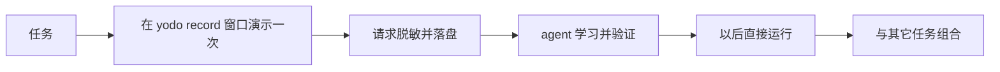

# yodo

> [!NOTE]
> **You only do once：只需要你演示一次。**

yodo 是一个帮助你完成个人浏览器任务的 skill，与 `browser-use`、`agent-browser` 属于同类浏览器任务工具。

yodo 使用你本机已登录账号的 Google Chrome 完成任务；

新任务只需演示一次，学会后可直接运行脚本，**完成任务更快、token 消耗更少**。

## 1. 性能

### 1.1 对比结果

测试任务：读取 X Following 最近 3 条，生成中文摘要，再分别发布到知乎和即刻。

| 工具 | 成功 | 耗时 | 花费 |
|---|---:|---:|---:|
| **`yodo (run)`** | 是 | **56 秒** | **$0.24** |
| `agent-browser` | 是 | 6 分 25 秒 | $0.83 |
| `browser-use` | 是 | 9 分 45 秒 | $0.93 |
| `yodo (learn)` | 是 | 6 分 46 秒 | $0.83 |


- **`yodo (run)`**：运行已有脚本。
- **`yodo (learn)`**：用户演示后，学习并完成任务。

> [!NOTE]
> 清空上下文后，`agent-browser` 和 `browser-use` 执行速度基本不变；`yodo (run)` 可复用已有脚本，通常比首次学习更快。

每种方式只测试一次，结果不是多次平均。详细数据见 [Benchmark 说明](#6-benchmark-说明)。

### 1.2 性能分析

shell 次数表示 Claude Code 发起了多少次工具调用。思考时间是 trace 中所有 `Thought for ...` 的合计。

| 方式 | shell 次数 | trace 记录的思考时间 |
|---|---:|---:|
| **`yodo (run)`** | **3** | **20 秒** |
| `agent-browser` | 26 | 2 分 42 秒 |
| `browser-use` | 38 | 3 分 58 秒 |
| `yodo (learn)` | 22 | 2 分 19 秒 |

> [!NOTE]
> 思考时间不等于完整任务耗时。较少的 shell 次数和思考时间，表示复用已学会的接口比逐步操作页面更直接。

**`agent-browser`**

查看 X 并读取内容，再依次打开知乎和即刻，寻找入口、填写、发布并确认，共执行 **26 次 shell**。

**`yodo (run)`**

直接执行 3 个已有脚本，分别读取 X、发布知乎和发布即刻，共执行 **3 次 shell**。

> [!NOTE]
> `yodo (learn)` 只需执行一次。学会读取 X Following、发布知乎想法和发布即刻帖子后，`yodo (run)` 可在后续任务中直接复用。

## 2. 安装与更新

### 2.1 交给 agent 执行

把下面整段复制给你的 agent：

```text
请安装或更新 yodo。读取并严格执行这份说明：
https://github.com/yanggggjie/yodo/blob/main/skills/yodo/install.md
```

公开安装跟随 GitHub 默认分支 `main`。

> [!IMPORTANT]
> - 新网站需先演示一次，yodo 不会自行探索。
> - **yodo 更适合普通网站**。抖音、小红书等风控网站会 fallback 到 DOM 操作运行较慢；
> - 请勿批量使用，以免影响网站运行或账号安全。

## 3. 使用

### 3.1 直接布置任务

```text
yodo 帮我搜索一下知乎 agent，然后看看第三条帖子的内容是什么，再给第三条点赞
```

### 3.2 教 yodo 学会新操作

```text
yodo 我教你查看我 X 关注用户的最新 10 条动态
```

### 3.3 查看 yodo 会什么

```text
yodo 你会什么？
```

### 3.4 组合复杂任务

可以在复杂任务的任意环节使用 yodo：

```text
TypeError: Cannot read properties of undefined (reading 'id')

先看一下上述报错信息，然后找到对应的代码，结合代码上下文看看有上报什么日志，
使用 yodo 来查日志，然后修复这个 bug
```

首次连接 Chrome 时，按 agent 提示打开 Chrome、允许 remote debugging 并点击 Allow，然后回复“好了”。

> [!IMPORTANT]
> 规则只有一条：输入中带上 `yodo` 这个触发词。

**演示视频**

[演示视频](https://www.youtube.com/watch?v=KfW4o9qQoE0)

## 4. 工作方式

### 4.1 第一次学习



1. 你在标题为 `yodo record` 的窗口中按清单演示。
2. yodo 录下相关请求，并在落盘前处理敏感信息。
3. agent 根据演示材料学会任务。

### 4.2 后续运行

1. agent 找到匹配的能力。
2. yodo 使用 Chrome 中现有的登录态完成任务。

## 5. 票据及隐私

### 5.1 运行时

token 和 Cookie 保存在 Chrome 中。脚本在页面内使用当前登录态，agent 不读取原始凭据。

### 5.2 学习时

token、Cookie 和密码在交给 agent 前脱敏，录制的材料可在 `~/.yodo/record` 查看。同一原始值稳定替换为同一个 `secret_NNN`；Cookie 名称、token 类型和普通业务字段保留，原始值不可见。

**Cookie 示例**

```text
# 原始
Cookie: sid=s3cretValue; theme=dark

# agent 看到的
Cookie: sid=⟨secret_001:text:bytes=11⟩; theme=⟨secret_002:text:bytes=4⟩
```

**Token 示例**

```text
# 原始
Authorization: Bearer aaa.bbb.ccc
{ "token": "aaa.bbb.ccc", "itemId": "123456789" }

# agent 看到的
Authorization: Bearer ⟨secret_001:jwt:bytes=11⟩
{ "token": "⟨secret_001:jwt:bytes=11⟩", "itemId": "123456789" }
```

### 5.3 本机数据

yodo 以源码分发，源码、`task`、`record` 等**所有数据**都保存在本机，可随意查看：

```text
~/.yodo/
```

## 6. Benchmark 说明

### 6.1 前置条件与任务

X、知乎、即刻都已在本机 Chrome 登录。

```text
使用 [yodo / browser-use / agent-browser]

1. 打开 X 我的 Following，取最近 3 条，总结成一段中文摘要，后缀带 from-[工具名]
2. 用这段摘要发一条知乎想法
3. 用这段摘要发一条即刻新动态
```

### 6.2 成功条件与测试设定

知乎和即刻两条内容均确认发布，且后缀正确。

| 项目 | 设定 |
|---|---|
| 环境 | Claude Code v2.1.251 |
| 模型 | `claude-sonnet-5`，偶发少量 haiku，具体见 `/cost` |
| 次数 | 每家、每阶段 1 次 |
| 计量 | 任务结束后在同一 session 中运行 `/cost` |

耗时取 `Total duration (wall)`，花费取 `Total cost`。测试不用 MCP，不用站点官方 API。每家从新 session 或 `/clear` 开始，只运行一件任务。

### 6.3 原始记录

| 工具 | 目录与文件 |
|---|---|
| `yodo (run)` | [`bench/results/yodo/run/`](bench/results/yodo/run/) · [`prompt`](bench/results/yodo/run/prompt.txt) · [`cost`](bench/results/yodo/run/useage.txt) · [`trace`](bench/results/yodo/run/trace-run.txt) |
| `agent-browser` | [`bench/results/agent-browser/`](bench/results/agent-browser/) · [`prompt`](bench/results/agent-browser/prompt.txt) · [`cost`](bench/results/agent-browser/useage.txt) · [`trace`](bench/results/agent-browser/trace.txt) |
| `browser-use` | [`bench/results/browser-use/`](bench/results/browser-use/) · [`prompt`](bench/results/browser-use/prompt.txt) · [`cost`](bench/results/browser-use/usage.txt) · [`trace`](bench/results/browser-use/trace.txt) |
| `yodo (learn)` | [`bench/results/yodo/learn/`](bench/results/yodo/learn/) · [`prompt`](bench/results/yodo/learn/prompt.txt) · [`cost`](bench/results/yodo/learn/useage.txt) · [`trace`](bench/results/yodo/learn/trace-learn.txt) |

`cost` 包含花费、耗时和模型用量；`trace` 包含思考时间、文件读取、shell 调用和最终结果。

### 6.4 运行备注

- **`yodo (run)`**：已经学会了这个任务，直接执行。
- **`agent-browser`**：使用独立 profile `~/temp-agent-browser-profile/` 的标准版 Chrome 和 CDP，否则无法登录 google 账号。
- **`browser-use`**：读取 X Following 时跳过一条广告推文；知乎和即刻均一次发布成功。
- **`yodo (learn)`**：用户先演示，agent 学会并验证后完成任务。
- 图由 [`bench/charts.py`](bench/charts.py) 生成。

## 7. License

### 7.1 适用范围

yodo 源码使用 [Apache License 2.0](LICENSE)。用户创建的 `task`、`record`、session 和其它运行数据均属用户。

**使用要求：yodo 仅用于完成个人浏览器任务，不得用于恶意抓取数据。**
