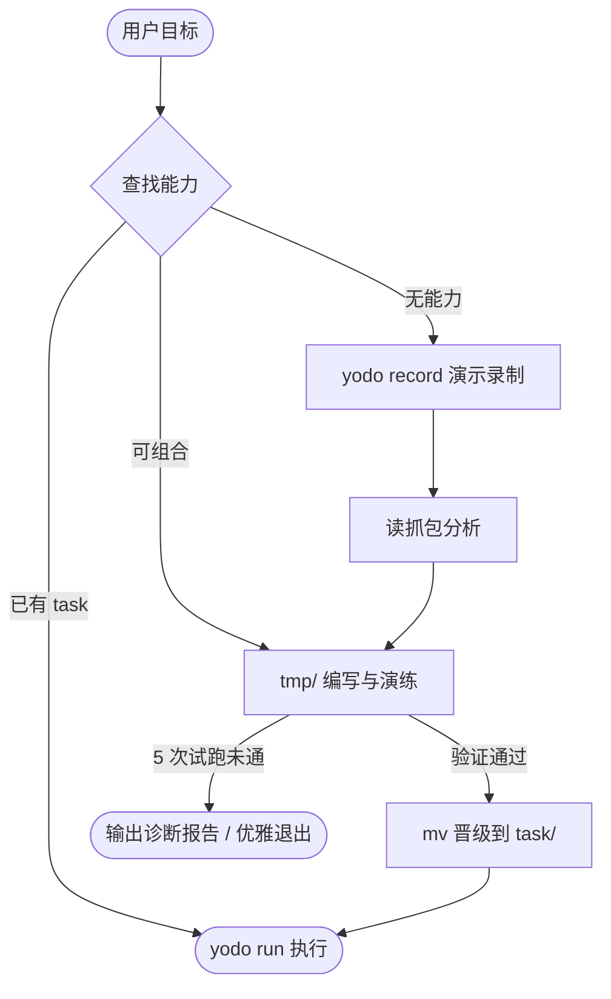

# yodo

**You Only Do Once**：用户演示一次，Agent 读抓包沉淀为任务脚本（task），之后全自动执行（run）。



---

## 安装

```bash
npx -y yodo-cli@latest init
```

本地开发调试：

```bash
npm run dev:install
```

---

## CLI 命令

```text
yodo init [--local]
yodo record start [name] [--goal="..."]
yodo record stop
yodo record abort
yodo run <file> [--args='<json>' | --args-file=<file>] [--timeout=<15-60>]
```

---

## 数据目录结构（`~/.yodo/`）

```text
~/.yodo/
├── session/                                 # [会话管理]
│   ├── session.sock                         # Unix domain socket
│   ├── session.pid                          # Holder 进程 PID
│   └── log.jsonl                            # session JSONL（handshake / op / CDP 失败）
├── task/                                    # [能力资产] 纯单文件 ESM
│   ├── _common/                             # 通用辅助模块（pageForOrigin, url 等）
│   │   ├── page-for-origin.js
│   │   └── url.js
│   ├── github-star-repo.js                  # 单文件 Task（JSDoc 注释）
│   └── v2ex-daily-checkin.js
├── tmp/                                     # [演练场] Agent 编写并验证脚本的临时目录
│   ├── probe_star.js
│   └── probe_input.json                     # 测试入参
└── record/                                  # [录制归档] 扁平清晰的抓包文件
    └── rec-20260827T080000Z/
        ├── timeline.jsonl                   # 单行时序流（手势与网络简报）
        ├── 01_GET_github.com_login.json     # 包含完整的 request 与 response
        ├── 01_GET_github.com_login.response.html # 大 HTML 单独落盘
        ├── 02_POST_api.github.com_graphql.json
        └── audit.log                        # 广告拦截审计记录
```

---

## 最小使用流程

```bash
# 1. 查找现有 task：若已有匹配，直接执行
yodo run ~/.yodo/task/github-star-repo.js --args='{"repo":"owner/repo"}'

# 2. 若无能力：开始录制
yodo record start my-action --goal="演示特定业务操作"

# 3. 在弹出的专属新窗口中操作，完成后告知「好了」
yodo record stop

# 4. 分析 ~/.yodo/record/my-action/ 下的 timeline.jsonl 与抓包文件，在 tmp/ 下编写试跑脚本
yodo run ~/.yodo/tmp/probe.js --args-file=~/.yodo/tmp/input.json

# 5. 验证通过后移入 task/
mv ~/.yodo/tmp/probe.js ~/.yodo/task/my-action.js
```

详见 `skills/yodo/SKILL.md`。
