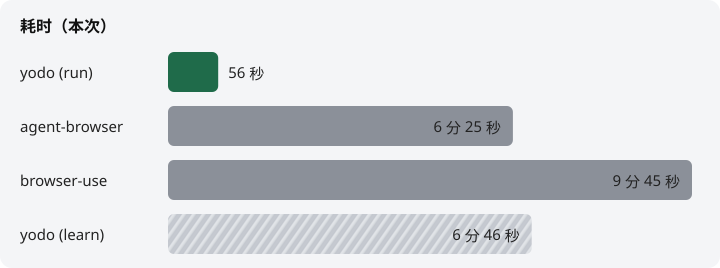
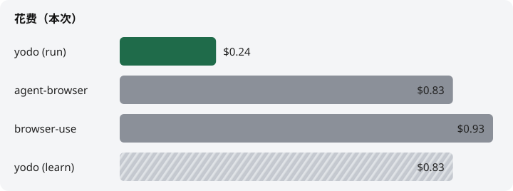

# yodo

用本机已经登录的 Chrome 做事。你在 Chrome 里能做的，也可以让它做。

做不成会说明原因。

## 安装或更新

把下面整段复制给你的 agent：

```
请安装或更新 yodo。读取并严格执行这份说明：
https://github.com/yanggggjie/yodo/blob/main/skills/yodo/install.md
```

## 怎么用

Agent 对话里说 `yodo` + 要做的事：

```
yodo 帮我搜索一下知乎 agent 然后看看第三条帖子的内容是什么，然后给第三条点赞
```

```
yodo 打开我的 X，总结我的关注最近三条是什么
```

```
yodo 搜小红书「东京咖啡」，把前三条标题给我
```

第一次连 Chrome 时，agent 会把要点念给你（开 Chrome、勾 remote-debugging、点 Allow）。做完回「好了」即可。

## 同一任务比一次

[browser-use](https://github.com/browser-use/browser-use) 和 [agent-browser](https://github.com/vercel-labs/agent-browser) 都是看着页面点。yodo 第一次请你在 Chrome 里做一遍，把请求写成脚本；之后同一类事直接跑脚本。

下面是同一个跨站任务，各跑一次：从 X 关注里取最近 3 条，写成中文摘要，发到知乎想法和即刻。

### 结论





`yodo (run)` 在第一行：`task` 已经在了，只跑、不再录、不再写脚本。`yodo (learn)` 在最后一行：人做一遍、写出 `task`，并顺带做完同一件事。同类能力只学一次；学到的是这次录到的请求怎么发，下次换参数，或和别的 `task` 拼起来用。

各家各跑了一次，不是多次平均。

| | 成功 | 耗时 | 花费 |
|--|--|--|--|
| **yodo (run)** | 是 | 56 秒 | $0.24 |
| agent-browser | 是 | 6 分 25 秒 | $0.83 |
| browser-use | 是 | 9 分 45 秒 | $0.93 |
| yodo (learn) | 是 | 6 分 46 秒 | $0.83 |

三家都发出来了。知乎想法和即刻动态都能对上，摘要后缀是对应工具名。

### 为什么差这么多

另外两家每做一步都要再看一眼页面：现在长什么样、点哪里、填什么，都得再喂给模型。步骤一多，时间和花费一起涨。

yodo 拆成两段：

1. 第一次：你在标题为 `yodo record` 的窗口里按清单做一遍。对着录下来的请求写出 `task/*.js`。
2. 之后：读已有脚本，打开页面，用页内 `fetch` 带上 Chrome 里的登录态发请求，不再一步步点。

所以跑起来大致是「读脚本 + 有限几次接口」，不跟着页面点击次数涨。代价是第一次要把脚本写出来。

代码比「看了再点、点了再看」更短，也更稳。

这样比，只对有稳定接口的站点公平。要靠认图、过验证码，或站点已经有现成 API 的，不拿来当主要结论。

### 登录态怎么处理

**跑的时候。** cookie 还在本机 Chrome 里。agent 写的是到页面里去 `fetch`（`credentials: "include"`），自己不读 cookie。接口返回的业务数据会回到 agent——摘要、帖子 id 本来就要回来，任务才能做完。这是默认写法，不是沙箱：skill 要求走页内 `fetch`、不操作 DOM；如果执意去读 `document.cookie`，设计拦不住。

**学的时候。** 录下来的请求落盘前会把敏感值换成稳定的 alias。cookie 的名字还在，值没了；token 也一样。agent 能看出「有一个叫 `sid` 的 cookie，这是 JWT」，所以写得出重放脚本，但拿不到原始值。同一段原始值会映射到同一个 `secret_NNN`。

Cookie：

```text
# 原始
Cookie: sid=s3cretValue; theme=dark

# agent 看到的
Cookie: sid=⟨secret_001:text:bytes=11⟩; theme=⟨secret_002:text:bytes=4⟩
```

Token：

```text
# 原始
Authorization: Bearer aaa.bbb.ccc
{ "token": "aaa.bbb.ccc", "itemId": "123456789" }

# agent 看到的
Authorization: Bearer ⟨secret_001:jwt:bytes=11⟩
{ "token": "⟨secret_001:jwt:bytes=11⟩", "itemId": "123456789" }
```

`itemId` 这类业务字段还在。

**源码在本机。** 跑的代码和这次的 `task` / `record` / `session` 都在 `~/.yodo`，可以打开看。skill 也是源码直接分发，不是封装好的二进制。

### 学不会的，和账号

有的接口会学不会。常见是发帖、支付、验证码这类：页面脚本和服务端会交叉校验一次性参数或设备信息，只把录到的请求再发一遍不够。这时 yodo 会说学不会，而不是硬编。

登录态按上面的方式处理，不等于对站点隐身。短时间大量发帖、刷接口，仍可能被限制账号。请留意。

### 附录

#### 任务

前置：X、知乎、即刻都已经在本机 Chrome 登录。

```txt
使用 [yodo / browser-use / agent-browser]

1. 打开 X 我的 Following，取最近 3 条，总结成一段中文摘要，后缀带 from-[工具名]
2. 用这段摘要发一条知乎想法
3. 用这段摘要发一条即刻新动态
```

成功：两条都确认发出去了，后缀对得上。

yodo 跑的那次：`task/` 里已经有对应脚本，只跑。

#### 怎么跑的

| 项 | 设定 |
|--|--|
| 环境 | Claude Code v2.1.251 |
| 模型 | `claude-sonnet-5`（偶发很少量 haiku，见 `/cost`） |
| 次数 | 每家 / 每阶段 1 次 |
| 计量 | 任务结束后同一 session 里 `/cost` |

耗时取 `Total duration (wall)`，花费取 `Total cost`。不用 MCP，不用站点官方 API key。每家从新 session（或 `/clear`）开始，只跑这一件事。

#### 原始记录

| | 耗时 | 花费 | 原始文件 |
|--|--|--|--|
| yodo (run) | 56 秒 | $0.24 | [`bench/results/yodo/run/`](bench/results/yodo/run/) |
| agent-browser | 6 分 25 秒 | $0.83 | [`bench/results/agent-browser/`](bench/results/agent-browser/) |
| browser-use | 9 分 45 秒 | $0.93 | [`bench/results/browser-use/`](bench/results/browser-use/) |
| yodo (learn) | 6 分 46 秒 | $0.83 | [`bench/results/yodo/learn/`](bench/results/yodo/learn/) |

每次的目录里有 prompt、trace、`/cost` 原文。

- **yodo (run)**：三份 `task` 都在，按拆好的几份依次跑完；给出了知乎 pin 和即刻动态的核对链接。
- **agent-browser**：默认测试版 Chrome 不好登录；prompt 里改成独立 profile（`~/temp-agent-browser-profile/`）的标准版 Chrome + CDP。这次端口是 9223（9222 已被占用）。
- **browser-use**：X Following 取条时跳过一条广告推文；知乎、即刻都一次发成。
- **yodo (learn)**：请人在 `yodo record` 窗做一遍、停录、对着 `recordDir` 写 `tmp/` 脚本、试跑成功后进 `task/`，学完后直接跑完原任务。首次写发布脚本时各留了一条测试内容（知乎「测试 from-yodo」、即刻「测试2 from-yodo」），正式摘要帖另外发了。

图由 [`bench/charts.py`](bench/charts.py) 生成。

#### `/cost` 原文

##### yodo (run)

```text
Total cost:            $0.2379
Total duration (API):  39s
Total duration (wall): 56s
Usage by model:
    claude-haiku-4-5:  975 input, 40 output, 0 cache read, 0 cache write ($0.0012)
     claude-sonnet-5:  12 input, 1.0k output, 235.3k cache read, 71.8k cache write ($0.2368)
```

##### agent-browser

```text
Total cost:            $0.83
Total duration (API):  4m 56s
Total duration (wall): 6m 25s
Usage by model:
    claude-haiku-4-5:  1.0k input, 26 output, 0 cache read, 0 cache write ($0.0012)
    claude-sonnet-5:  59 input, 9.3k output, 2.8m cache read, 72.7k cache write ($0.83)
```

##### browser-use

```text
Total cost:            $0.93
Total duration (API):  8m 36s
Total duration (wall): 9m 45s
Usage by model:
    claude-haiku-4-5:  977 input, 29 output, 0 cache read, 0 cache write ($0.0011)
     claude-sonnet-5:  89 input, 11.0k output, 2.7m cache read, 114.7k cache write ($0.93)
```

##### yodo (learn)

```text
Total cost:            $0.83
Total duration (API):  4m 33s
Total duration (wall): 6m 46s
Usage by model:
    claude-haiku-4-5:  975 input, 35 output, 0 cache read, 0 cache write ($0.0011)
     claude-sonnet-5:  72 input, 12.7k output, 2.4m cache read, 83.5k cache write ($0.83)
```
