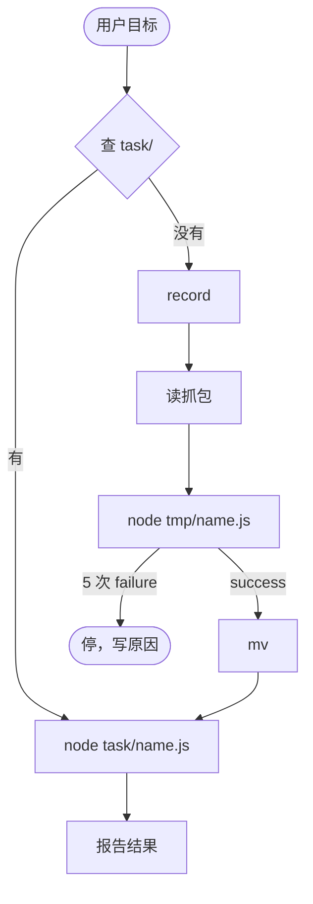

# yodo

用本机已登录的 Chrome 做成用户目标：能跑 `task/` 就 `node task/<name>.js`；没有就 `record`，读抓包，`node tmp/<name>.js`，`success` 后 `mv` 再 `node task/<name>.js`。

task 跑成功后报告结果：做了什么，并给一个能核对的 URL。



Agent 流程见 `skills/yodo/SKILL.md`。

---

## 安装

只需 **Node ≥24 + Chrome**。装 skill 后在 skill 目录：

```bash
node setup.js   # ~/.yodo/src 链接到 skill 源码（个别环境降级为拷贝），并建数据目录
```

本地开发：见 `AGENTS.md`（`npm run dev:install` / `verify:pack`）。

---

## 命令

没有 CLI，只有脚本(`yodo` = `import { yodo } from "…/sdk.ts"` 的 SDK):

```text
node ~/.yodo/src/bin/start.js          # 拉起 holder 并连 Chrome(首次点一次 allow)
node ~/.yodo/src/bin/stop.js
node ~/.yodo/src/bin/doctor.js
node ~/.yodo/src/bin/record-start.js [name]
node ~/.yodo/src/bin/record-stop.js
node ~/.yodo/src/bin/record-abort.js
node ~/.yodo/task/<name>.js [参数]       # task 是自执行脚本,参数走 argv
```

---

## `~/.yodo/`

```text
~/.yodo/
├── session/     # CDP 连接的 pid · sock · log
├── task/        # 已验证脚本
│   └── _common/
├── tmp/         # 未验证脚本
└── record/      # 抓包
    └── <name>/
        ├── timeline.jsonl
        ├── 01_GET_host_path.json
        ├── 01_GET_host_path.response.json
        └── 01_GET_host_path.response.html
```

---

## 最小用法

```bash
node ~/.yodo/task/github-star-repo.js owner/repo   # 参数走 argv

node ~/.yodo/src/bin/record-start.js my-action
# 在新窗口做一遍，回「好了」
node ~/.yodo/src/bin/record-stop.js

# 读 ~/.yodo/record/my-action/，在 tmp/ 写自执行脚本
node ~/.yodo/tmp/my-action.js

mv ~/.yodo/tmp/my-action.js ~/.yodo/task/my-action.js
```
