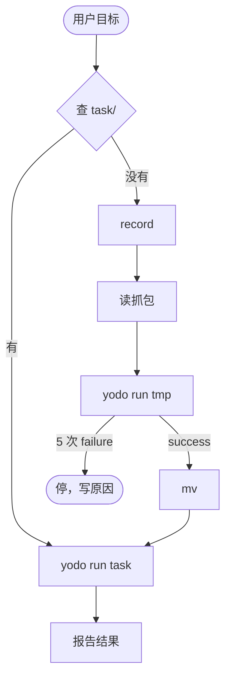

# yodo

用本机已登录的 Chrome 做成用户目标：能跑 `task/` 就 `yodo run <task>`；没有就 `record`，读抓包，`yodo run <tmp>`，`success` 后 `mv` 再 `yodo run <task>`。

`yodo run` 成功后报告结果：做了什么，并给一个能核对的 URL。



Agent 流程见 `skills/yodo/SKILL.md`。

---

## 安装

```bash
npx -y yodo-cli@latest init
```

本地开发：

```bash
npm run dev:install
```

---

## CLI

```text
yodo init
yodo record start [name]
yodo record stop
yodo record abort
yodo run <file> [--args='<json>' | --args-file=<file>] [--timeout=<15-60>]
```

---

## `~/.yodo/`

```text
~/.yodo/
├── session/     # CDP 连接的 pid · sock · log
├── task/        # 已验证脚本
│   └── _common/
├── tmp/         # 未验证脚本
└── record/      # 抓包
    └── <name>/
        ├── timeline.jsonl
        ├── 01_GET_host_path.json
        ├── 01_GET_host_path.response.json
        └── 01_GET_host_path.response.html
```

---

## 最小用法

```bash
yodo run ~/.yodo/task/github-star-repo.js --args='{"repo":"owner/repo"}'

yodo record start my-action
# 在新窗口做一遍，回「好了」
yodo record stop

# 读 ~/.yodo/record/my-action/，在 tmp/ 写脚本
yodo run ~/.yodo/tmp/my-action.js

mv ~/.yodo/tmp/my-action.js ~/.yodo/task/my-action.js
```
