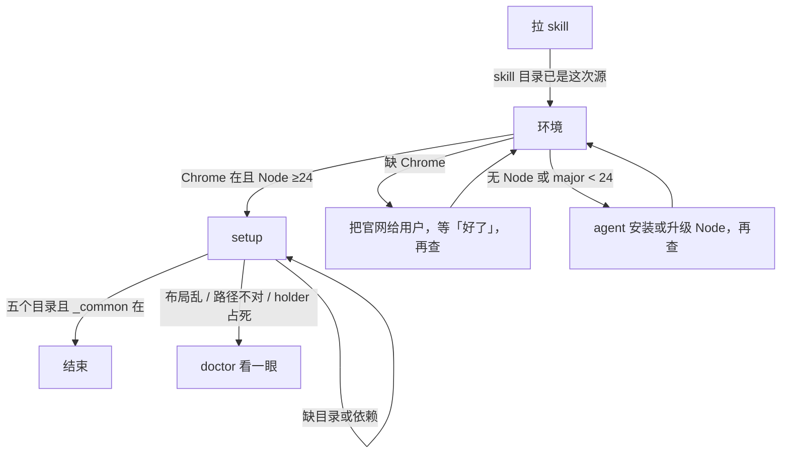

# workflow

```mermaid
flowchart TD
  pull["拉 skill"] -->|"skill 目录已是这次源"| env["环境"]
  env -->|"Chrome 在且 Node ≥24"| setup["setup"]
  env -->|"缺 Chrome"| waitChrome["把官网给用户，等「好了」，再查"]
  waitChrome --> env
  env -->|"无 Node 或 major < 24"| fixNode["agent 安装或升级 Node，再查"]
  fixNode --> env
  setup -->|"五个目录且 _common 在"| done["结束"]
  setup -->|"缺目录或依赖"| setup
  setup -->|"布局乱 / 路径不对 / holder 占死"| doctor["doctor 看一眼"]
```

`need-chrome` / `need-remote-debugging` / `need-allow` 不在这张图里。那些是第一次连浏览器，不是安装或更新失败。
