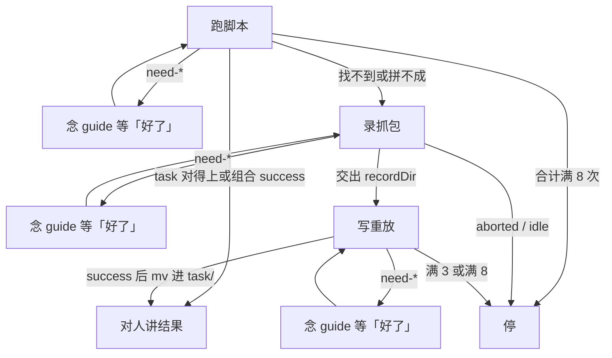

# workflow

```mermaid
flowchart TD
  run[跑脚本] -->|task 对得上或组合 success| report[对人讲结果]
  run -->|need-*| waitRun[念 guide 等「好了」]
  waitRun --> run
  run -->|找不到或拼不成| rec[录抓包]
  run -->|合计满 8 次| stop[停]
  rec -->|need-*| waitRec[念 guide 等「好了」]
  waitRec --> rec
  rec -->|交出 recordDir| replay[写重放]
  rec -->|aborted / idle| stop
  replay -->|need-*| waitReplay[念 guide 等「好了」]
  waitReplay --> replay
  replay -->|success 后 mv 进 task/| report
  replay -->|满 3 或满 8| stop
```
