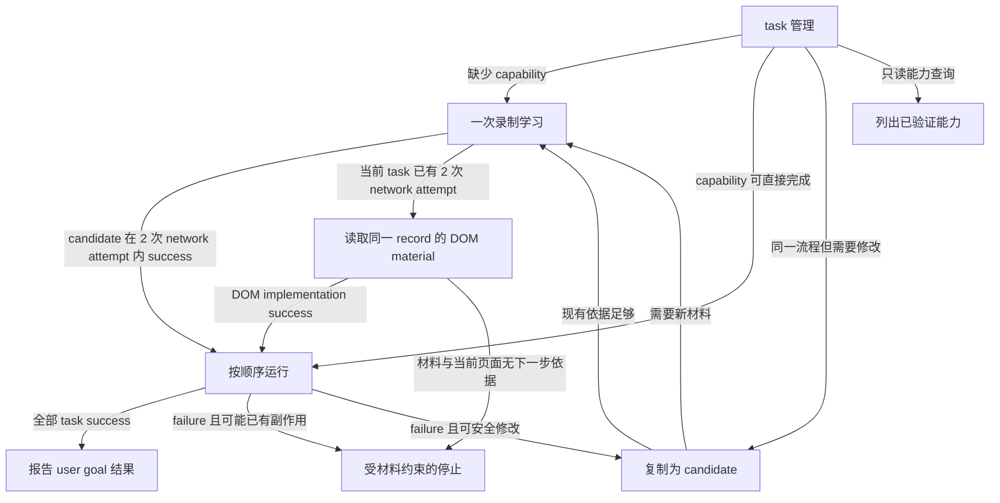

# workflow

```mermaid
flowchart TD
  A["task 管理"] -->|缺少 capability| B["一次录制学习"]
  A -->|capability 可直接完成| R[按顺序运行]
  A -->|同一流程但需要修改| M[复制为 candidate]
  M -->|现有依据足够| B
  M -->|需要新材料| B
  B -->|candidate 在 2 次 network attempt 内 success| R
  B -->|当前 task 已有 2 次 network attempt| D[读取同一 record 的 DOM material]
  D -->|DOM implementation success| R
  D -->|材料与当前页面无下一步依据| S["受材料约束的停止"]
  R -->|全部 task success| O[报告 user goal 结果]
  R -->|failure 且可能已有副作用| S
  R -->|failure 且可安全修改| M
  A -->|只读能力查询| Q[列出已验证能力]
```
