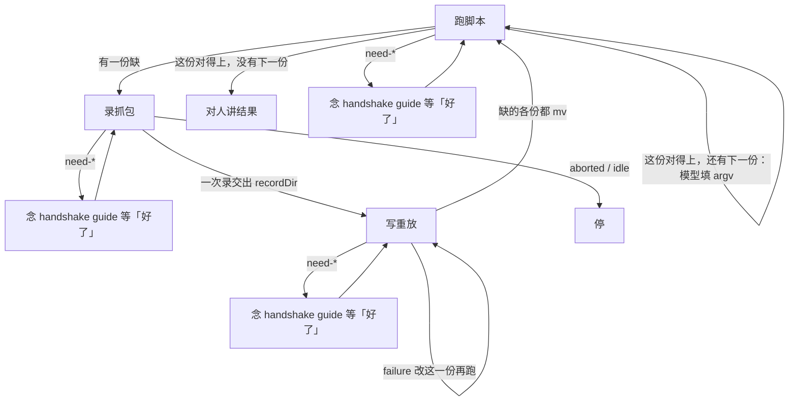

# workflow

```mermaid
flowchart TD
  run[跑脚本] -->|有一份缺| rec[录抓包]
  rec -->|need-*| waitRec[念 handshake guide 等「好了」]
  waitRec --> rec
  rec -->|一次录交出 recordDir| replay[写重放]
  rec -->|aborted / idle| stop[停]
  replay -->|need-*| waitReplay[念 handshake guide 等「好了」]
  waitReplay --> replay
  replay -->|failure 改这一份再跑| replay
  replay -->|缺的各份都 mv| run
  run -->|这份对得上，还有下一份：模型填 argv| run
  run -->|这份对得上，没有下一份| report[对人讲结果]
  run -->|need-*| waitRun[念 handshake guide 等「好了」]
  waitRun --> run
```
