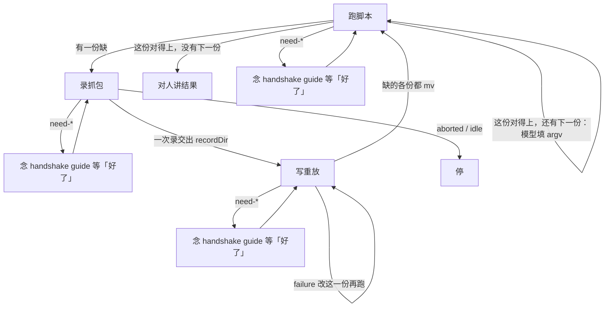

触发 yodo。第一下：按这句 user prompt 切开（模型介入才拆），再只在 `.yodo/task/*.js` 里看各份在不在。有缺 → 对人一次录（只说要做的操作，不念拆分点）。不要打开 `tmp/`。



`.yodo` 在用户 home 下。文中路径相对 `.yodo/`，跑命令用绝对路径（Windows 不要用 `~`）。没有 CLI，只有 `src/bin/*.js` 和自执行脚本。`task` 只指 `.yodo/task/*.js`。找对得上只看 `task/`；`tmp/` 是废料，不算对得上。对人说任务本身，不把拆分点、argv、`task` 名字当流程念出来。安装走同目录 `install.md`，不进本文件。

同一句 user prompt：对 agent 按拆分点切成多份 `task`；对人把这次缺的操作收成一次录。切开后每一份对应将来一份 `task`。切开结果不落盘。

## 1. 跑脚本

只有 `task/` 是已验证能力。按切开后的这一份带参数跑，读同一套 stdout（`success` / `failure` / `need-*`），并对人报告 `result` / `resultFile`。检验 URL 由 agent 看刚跑的那份脚本现拼。找对得上只看 `task/`。

### 1.1 跑已有 task

分类：

- 同一句 user prompt：对 agent 按拆分点切成多份 `task`；对人把这次缺的操作收成一次录。切开后每一份对应将来一份 `task`。切开结果不落盘
- 必须切开：模型介入（从列表里挑、读自然语言再决策、改写正文、判断成没成）
- 不要切开：连续的纯代码（`goto`、页内 `fetch` / XHR、用已有 id 拼 URL）合成一份。中间没有模型、全程纯代码 → 仍是一份。不要每个接口一份，也不要无脑收成一份做完整句 prompt
- 这份对得上：`task/*.js` 里有覆盖**这一份**的。各份都在才一份一份带参数跑
- 切开后只要有一份缺：先去录用户操作。不要先跑已有的那些份
- `task/` 里已有一份把两份合成、但这句 prompt 中间要模型：这份不能当整件对得上，也不能当其中一份。按拆分点去找/去写更小的两份
- 不要打开、不要列举 `tmp/` 来判断能不能做。`tmp/` 是废料，不算对得上，不能当候选

怎么跑：

1. 只在 `.yodo/task/*.js` 里按这一份找（怎么查自定）。不要看 `tmp/`
2. 读文件头 `@summary`（含 argv 位置）和顶部不变的量（如 `ORIGIN`）
3. 第一份的参数也来自这次 prompt（模型先填）。上一份的 `result`（大的走 `resultFile`）由模型处理后当 argv 传给下一份。模型不操作浏览器
4. 只许改参数对齐这次 / 上一份的输出，不许改请求逻辑
5. `node <home>/.yodo/task/<name>.js <参数>`。随这次变的、跨 task 的走 `process.argv`
6. 同一份 `task` 这句 prompt 用两次（两个 id）→ 跑两遍、换参数，不要复制成第二个文件
7. 不 `import` 别的 task。衔接是跑完、看 stdout、再跑下一份
8. 需要浏览器时命令会自己连

stdout 对照：

| stdout | 做什么 |
|---|---|
| `need-install` / `need-chrome` / `need-remote-debugging` / `need-allow` | 把 `guide` 原样念给用户，停，等用户回「好了」，再重跑刚才那条命令。不轮询，不改写 `guide` |
| 只有 `error`、没有 `status` | 命令没跑起来，停，对人说明没跑起来 |
| `status: success` | 对人说这次做成了什么，用 `result` 或 `resultFile`。只说任务本身。还有下一份：模型处理后再跑下一份 |
| `status: failure` | 参数已对齐仍失败：停，对人说明原因，不要改 `task/` 里的请求逻辑 |

`success` 时：

- 结果超过约 8KB 会落同目录 `output.json`，stdout 给 `resultFile`，打开它再讲
- 检验用的页面地址不要从脚本 return 里取
- 打开刚跑的那份 `task/*.js`，按它的顶部常量、`goto` / 路径模板、这次 argv，以及 `result` 里的 id，现拼用户能打开核对的 URL
- 必须带正确的 path 和 query
- 不要拿 fetch 端点当检验地址
- 页面靠路径的就深链（如 `/pin/<id>`）
- query 用页面地址栏那几个键，不是 API 全套参数
- 不要在脚本 return 里写 `url`

卡住了杀 `session/pid`（断 CDP，不杀 Chrome）。stdout 不够再看 `session/log.jsonl`。

不是主路径：

- 用户要求断开连接时才跑 `node <home>/.yodo/src/bin/stop.js`
- 要先点一次授权也可以跑 `node <home>/.yodo/src/bin/start.js`（`ok` 即可继续；`need-*` 同样念 `guide`、等「好了」、再重跑），但跑 task 本身已经会连，不是必经

完成：

- 切开后该跑的各份都已跑过对得上的文件（或已先一次录、写完缺的各份再跑），并对人讲了结果
- 或已把 handshake `guide` 念出并在等「好了」
- 或现成 task `failure` 后已停并说明
- 没有先探索站点，没有把 `tmp/` 当能力，没有边跑边录

## 2. 录抓包

开录、等人、停录、放弃都只动 `src/bin/record-*.js` 和归档后的 `record/<name>/`，共享同一套 stdout（`recording` / `stopped` / `aborted` / `idle`）。同一句 prompt 里缺的操作一次录完；对人只说操作，不念拆分点。录制窗后台，空白 tab 标题 `yodo record`。recording 不印 `guide`。

### 2.1 录用户操作

分类：

- 同一句 user prompt：对 agent 按拆分点切成多份 `task`；对人把这次缺的操作收成一次录。切开后每一份对应将来一份 `task`。切开结果不落盘。不要把拆分点、argv、`task` 名字念给用户
- 该录：切开后至少有一份在 `task/` 里对不上。开**一次**录。对人只给操作清单（如搜、打开一条、点赞）。即使中间夹着模型、即使操作不连续不相干，也还是这一次。已有的那些份不用特意再演，走到能发出缺的请求即可。不要录完一份再把结果给模型再录。不要拆成多次 `record-start` / `stop`
- 不要录：各份都对得上
- 不要这次了：`node <home>/.yodo/src/bin/record-abort.js`

找已有能力只看 `task/*.js`。不要打开、不要列举 `tmp/`。不要先自己打开站点查看、写脚本探接口、猜请求，再决定要不要录。只在标题是 `yodo record` 的窗口里的 tab 做，已有窗不录。窗在后台，不抢前台。`stop` / `abort` 只关录制窗。5 分钟到会按 stop 归档。

命令：

1. 开录：`node <home>/.yodo/src/bin/record-start.js [name]`
2. 需要浏览器时命令会自己连
3. 不要这次了：`node <home>/.yodo/src/bin/record-abort.js`

stdout 对照：

| stdout | 做什么 |
|---|---|
| `need-install` / `need-chrome` / `need-remote-debugging` / `need-allow` | 把 `guide` 原样念给用户，停，等用户回「好了」，再重跑刚才那条命令。不轮询，不改写 `guide` |
| `status: recording` | 不要念 stdout 里的 `guide`（没有）。请用户到标题是 `yodo record` 的窗口，在那扇窗里的 tab 里把这些操作做一遍，做好回「好了」，再 `node <home>/.yodo/src/bin/record-stop.js`。这时还没有 `recordDir`，不要读 `record/.active/` |
| `status: stopped` 且有 `recordDir` | 去读这个目录 |
| `aborted` | 对人说明这次不要了；没有可用抓包，停 |
| `idle` | 对人说明当时没在录；没有可用抓包，停 |

`recordDir` 里的文件：

| 文件 | 是什么 | 怎么读 |
|---|---|---|
| `timeline.jsonl` | 索引。行：`type`、`requestType`、`method`、`url`、`file` | 小，任意读 |
| `01_GET_host.json` | request：`url`（`bareUrl` + `query`）、`frameUrl`、`headers`、`body`；这里的 `status` 是 HTTP，不是 yodo 的 `status` | 小，任意读 |
| `01_GET_host.response.json` | 响应体 > 1KB 时拆出 | 大，不要整份读 |
| `01_GET_host.response.html` | 整页 HTML | 大，不要整份读 |

卡住了杀 `session/pid`（断 CDP，不杀 Chrome）。stdout 不够再看 `session/log.jsonl`。

完成：

- `status: stopped` 且手上有 `recordDir`，可以去写缺的各份
- 或已说明没有抓到并停（`aborted` / `idle`）
- 开录之前没有自己打开站点、没有写探接口脚本
- 没有按份多次开录，没有把拆分点告诉用户

## 3. 写重放

缺的每一份写成 `tmp/<name>.js`，对着同一份 `recordDir`，带参数试跑。试跑落在 `tmp/`，成功才进 `task/`。一次录不收成一份做完整句 prompt 的脚本。`tmp/` 是废料，不算能力。

### 3.1 写出脚本

分类：

- 同一句 user prompt：对 agent 按拆分点切成多份 `task`；对人把这次缺的操作收成一次录。切开后每一份对应将来一份 `task`。切开结果不落盘
- 缺的每一份写成 `tmp/<name>.js`
- 对着这次的 `recordDir` 写这一份（多份缺的都从同一份 `recordDir` 拆请求）；没抓到的不补、不猜
- 写的时候不要停下来等模型
- 不要把已有 task 抄进同一份来做完整句 prompt
- 不要读、复用 `tmp/` 里已有的其它文件
- 不 `import` 别的 task
- 只发网络请求，不操作 DOM，也不拿 DOM 快照来操作
- 正路：`newPage()` 拿到 `yodo run` 窗里那一个 tab，`goto` 到该 origin 的页面，再页内 `fetch` / XHR。登录态来自 Chrome profile cookie，不是复用用户已打开的 tab

有抓包时：

1. 先读 `timeline.jsonl`（小，索引），定这一份要重放的接口
2. 再打开对应的 request JSON（小）
3. `late` 的 `mainDoc` 是迟到的页面快照，没有 `method`、也没有 HTTP `status`，比一次 HTML GET 信息更丰富：在这份快照里找信息，也可以对那个 `url` 再做 HTML GET

在 `tmp/<name>.js` 写自执行脚本，然后 `node <home>/.yodo/tmp/<name>.js <参数>`：

```javascript
/**
 * @summary 按关键词搜索
 * @param argv[2] 搜索词
 */
import { yodo, serializeUrl } from "../task/_common/yodo.js";
const ORIGIN = "https://example.com";
const q = process.argv[2] ?? "";
await yodo.run(async ({ browserContext }) => {
  const page = await browserContext.newPage();
  await page.goto(serializeUrl({ bareUrl: `${ORIGIN}/search`, query: { q } }));
  const data = await page.evaluate(async (q) => {
    /* 带登录态 fetch / XHR；只能用可序列化参数，不能闭包外层变量 */
    return {};
  }, q);
  return data;
});
```

API：

- `@summary` 写这份做什么和 argv 位置。`ORIGIN` 这种不变的可留在文件顶；随这次变的走 `process.argv`
- `_common/yodo.js` 给出 `yodo`、`serializeUrl`、`parseUrl`
- `browserContext.newPage()`：还 `yodo run` 窗里那一个 tab，不开新 tab，不挂用户已有 tab
- 页内 `fetch` 之前必须先 `goto` 到该 origin 的 URL（`about:blank` 上发跨 origin 请求会失败）
- `yodo.run` 在本进程跑闭包，浏览器操作发给已连上的 Chrome；闭包 return 的值变成 stdout 的 `result`
- 不要在 return 里写 `url`
- `page.goto(url, { timeout }?)` 没有 `waitUntil`
- `page.evaluate(fn, ...args)` 只能传可 JSON 序列化的参数
- `page.url()` / `page.title()` / `page.close()` / `page.bringToFront()` 也在，写重放用不到就别用

需要浏览器时命令会自己连。

stdout 对照：

| stdout | 做什么 |
|---|---|
| `need-install` / `need-chrome` / `need-remote-debugging` / `need-allow` | 把 `guide` 原样念给用户，停，等用户回「好了」，再重跑刚才那条命令。不轮询，不改写 `guide` |
| 只有 `error`、没有 `status` | 命令没跑起来，停，对人说明 |
| `status: success` | 写上 `@summary` 和 argv 说明，只有出现过 `status: success` 才能 `mv` |
| `status: failure` 且 403 | 多半是缺客户端签名，改走页内 XHR（站点常 monkey-patch `XMLHttpRequest`，会自动注入 `a_bogus` / `X-Bogus`），比手写逆向稳。页内太慢就减小数据量 |
| `status: failure` | 只改这一份 `tmp/<name>.js` 再跑。不要另开文件。不设次数上限，直到 `success` 或用户不要了 |

没出现过 `success` 不准把脚本放进 `task/`。

`success` 后留下：

1. `mv <home>/.yodo/tmp/<name>.js <home>/.yodo/task/<name>.js`（Unix `mv`，不是 yodo 子命令）
2. 再 `node <home>/.yodo/task/<name>.js <参数>`
3. task 这遍会自己连浏览器；`need-*` 就把 `guide` 原样念给用户，停，等「好了」，再重跑

这遍 `success`：

- 对人说这次做成了什么，用 `result` 或 `resultFile`。只说任务本身
- 大结果落同目录 `output.json` 时，打开 `resultFile` 再讲
- 还有缺的份没写：对着同一份 `recordDir` 继续写下一份，不要停下来等模型
- 缺的各份都 `mv` 完了、还有下一份：再按切开顺序跑整条（已有 + 新的），模型填 argv
- 检验用的页面地址不要从脚本 return 里取
- 打开刚跑的那份 `task/*.js`，按它的顶部常量、`goto` / 路径模板、这次 argv，以及 `result` 里的 id，现拼用户能打开核对的 URL
- 必须带正确的 path 和 query
- 不要拿 fetch 端点当检验地址
- 页面靠路径的就深链（如 `/pin/<id>`）
- query 用页面地址栏那几个键，不是 API 全套参数

卡住了杀 `session/pid`（断 CDP，不杀 Chrome）。stdout 不够再看 `session/log.jsonl`。

完成：

- 缺的各份都 `mv` 完成并带参数跑成功，已对人讲了结果
- 或用户不要了已停
- 没出现过 `success` 不准进 `task/`
- 没有把一次录收成一份做完整句 prompt 的脚本，没有把两份合成一份来躲拆分
