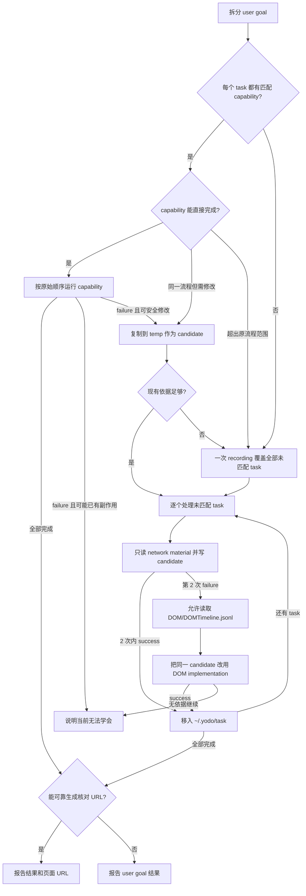

# yodo

yodo 将 `user goal` 拆成一个或多个 `task`。每个 `task` 是可独立执行和复用的程序，使用 `network implementation` 或 `DOM implementation`。尚未验证的 `task` 是 `candidate`；使用正式参数验证成功并移入 `~/.yodo/task` 后，成为 `capability`。

## 1. Glossary

### 1.1 Canonical terms

| Term | Definition | Not |
|---|---|---|
| `user goal` | 用户交给 yodo 完成的完整目标，可以包含多个网站和多个步骤 | 不是原始 prompt、HTTP request 或拆分后的单个 `task` |
| `task` | agent 根据 `user goal` 拆分并生成的可执行程序；一份 `task` 完成一个可独立执行和复用的流程 | 不是 `user goal`、目录或仅有目标描述的抽象步骤 |
| `candidate` | 尚未验证成功、保存在 `~/.yodo/temp` 的 `task` | 不能作为 `capability` 匹配或复用 |
| `capability` | 已经使用正式参数验证成功、保存在 `~/.yodo/task` 的 `task` | 不是文件之外的另一层对象 |
| `implementation` | `task` 完成流程的方式，目前为 `network implementation` 或 `DOM implementation` | `@executor` 是记录该值的 metadata 字段，不是另一种对象 |
| `recording` | 用户演示期间，yodo 采集 network 和 DOM 数据的过程 | 不是 `recording` 结束后保存的 `record` |
| `record` | `recording` 结束后保存的归档，由唯一 `record` name 标识 | 不是正在进行的 `recording`，也不是 `result` |
| `record material` | `record` 中用于创建或修改 `task` 的数据，包括 `network material` 和 `DOM material` | 不能代替正式运行 `task` |
| `network material` | `record` 中的 network request、response、HTML snapshot 和关联 timeline | 不包括完整 DOM event |
| `DOM material` | `record` 中的完整 DOM event 和 final state | 在满足读取条件前不能使用 |
| `task run` | 使用正式参数完整执行一次 `task` | 不是 holder 的 `run.begin` / `run.end`，也不表示执行一定成功 |
| `task status` | `task run` 输出的 `status: success` 或 `status: failure` | 不等于 `command status`、HTTP status 或 RPC `ok` |
| `command status` | yodo 命令在 stdout 输出的状态，包括 `need-*`、`recording`、`stopped`、`idle` 和 `task status` | 不是 HTTP status |
| `result` | `task` 在 `task status` 为 `success` 时返回的内容 | 不等于 `record material`、HTTP response 或 RPC response |
| `network attempt` | `candidate` 使用正式参数完成一次 `task run` 并返回 `status: failure` | 语法错误、命令未启动、`need-*` 和用户取消不计入 |

- 目录直接写实际路径；`task` 不用于指代 `~/.yodo/task` 或 `~/.yodo/temp` 目录。



## 2. 完成条件与边界

### 2.1 判断完成

- 用户明确要求使用 yodo 时，必须匹配 `capability`，必要时完成 `recording` 和学习，再运行全部 `task`。
- 每个 `task` 只有在对应 `capability` 或 `candidate` 使用本次正式参数输出 `status: success` 后才完成。`record material`、network response、HTML snapshot、DOM event、`status: stopped`、HTTP 2xx、holder 的 `ok`、找到元素或完成 click 都不能作为 `result` 或成功依据。
- 多个 `task` 按原始顺序串行运行，禁止并行。根据 task 判断最终结果存在可靠 URL 时，在报告中给出该 URL。
- 有副作用的操作只允许成功一次，并遵守“有副作用的操作”中的检查规则。

### 2.2 管理文件

- `~/.yodo/task/*.js` 是 `capability`；`~/.yodo/temp/*.js` 是 `candidate`。匹配 `capability` 时禁止读取、列举或复用 `candidate`。
- 一个 `task` 只完成一个可独立执行和复用的流程。`task` 之间不互相 import。
- network 与 DOM 实现使用相同的 `task`、`temp`、`@summary` 和 argv 规则。文件头必须包含 `@executor network` 或 `@executor dom`；该字段只记录 `implementation`，用于实现与排障，不改变 `capability` 匹配方式。
- `task` 必须包含至少一个 `@record <name>`，记录创建或修改时使用的 `record`；追加来源，不覆盖旧来源。

### 2.3 使用材料

- 缺少 `capability` 时不得自行打开目标站点、操作用户已有页面、写探测脚本或猜 endpoint。
- 同一个 `user goal` 只进行一次 `recording`，覆盖全部未匹配操作；不因某个 `task` 失败要求用户重新演示。
- network 阶段只能读取 `network material`。
- 当前 `task` 没有累计 2 次 `network attempt` 时，禁止读取、搜索或推断 `DOM material`。
- DOM 阶段必须以本次 `record` 的 `DOM/DOMTimeline.jsonl` 为起点；没有该 material 时不得自行探索网站。
- 进入 DOM 阶段后，可以读取当前运行窗口的 DOM 并自主定位、判断和操作，但只能完成当前 `task`。

### 2.4 用户侧信息

- 对用户只说明要演示的操作、需要人工处理的状态和 `user goal` 的最终结果。
- 不暴露 `task` 拆分、文件名、argv、`network attempt` 次数、`implementation` 选择或 `record` 路径。
- 当前材料无法继续时，直接说明这项操作目前无法稳定学会，不要求再次演示。

## 3. 处理 `command status`

### 3.1 根据 stdout 处理

每条 yodo 命令先读 stdout：

| stdout | 处理 |
|---|---|
| `need-install` / `need-chrome` / `need-remote-debugging` / `need-allow` | 将 `guide` 原样告诉用户，等待“好了”，随后重跑同一命令；不轮询、不改写 `guide`。 |
| 只有 `error`，没有 `status` | 命令未正常启动；停止并说明错误。 |
| `status: success` | 使用 `result`；有 `resultFile` 时先读取文件。 |
| `status: failure` | 按 `capability` 或 `candidate` 的规则处理。 |

结果超过约 8KB 时写入脚本同目录的 `output.json`，stdout 返回 `resultFile`；读取该文件后再处理结果。

## 4. 拆分与匹配

### 4.1 拆分 `user goal`

- 中间需要模型读取自然语言、挑选、判断、改写或决定下一步时必须拆开。
- 连续的纯代码动作保持一份，例如 `goto` 后发请求，或用已有 id 拼下一条 URL。
- 同一 `capability` 以不同参数出现多次时，运行同一个 `task` 多次。
- 前一个 `task` 的 `result` 由模型处理后，作为后一个 `task` 的 argv。

### 4.2 匹配并决定处理方式

1. 只搜索 `~/.yodo/task/*.js`。
2. 读取 `@summary`、`@executor`、argv 说明和必要的顶部固定常量；不读取 `~/.yodo/temp`。
3. 已有 `task` 跨过必须由模型介入的边界时，不得冒充多个独立 `task`。
4. 匹配后判断现有 `capability` 能否直接完成当前 `task`：
   - 只需传入不同 argv：直接运行，不修改。
   - 流程范围相同，但 endpoint、固定字段、selector、验证逻辑或其它实现细节需要调整：按“修改 capability”处理。
   - 当前目标超出原流程范围：视为没有匹配 `capability`，生成新的 `task`，不得扩大原 `capability`。
5. 只要有一个 `task` 没有匹配 `capability`，就先开始一次 `recording`，覆盖所有未匹配操作，不先运行已有部分。

### 4.3 回答能力查询

用户询问“你会什么”“能做什么”时：

1. 简要说明 yodo 能通过一次演示学习并复用需要登录态的网站操作。
2. 只读取 `~/.yodo/task/*.js` 的说明和必要常量。
3. 不读取 `temp`，不运行 `task`，不开始 `recording`。
4. 没有 `capability` 时，提示用户可以说“yodo 我教你……”。

## 5. 运行与修改 `capability`

### 5.1 执行并处理结果

一次只运行一个 `node ~/.yodo/task/*.js` 或 `node ~/.yodo/temp/*.js` 进程。不得并发、后台启动或使用并行工具调用；前一个命令返回 `task status` 后才能运行下一个。

```bash
node ~/.yodo/task/<name>.js <参数>
```

- `success`：保留 `result` 并继续下一个 `task`。
- HTTP 403：说明当前 Chrome 登录态不可用或已失效，让用户自行登录；不修改 `capability`，不重新 `recording`。
- 其它 `failure`：先判断操作是否可能已经产生副作用。无法确认时停止，不修改或重试；确认可以安全继续且实现需要调整时，按下面的“修改 capability”处理。
- `need-*`：按“处理 `command status`”执行。

所有 `task` 完成后，根据 `task` 中的 origin、页面 path、argv 和 `result` id 生成可核对的用户页面 URL。不得使用 API endpoint；信息不足时不猜 URL。

### 5.2 修改 `capability`

只有原 `capability` 的 `@summary` 仍准确描述当前 `task` 时，才修改它。当前目标增加了新的独立操作或跨过模型介入边界时，生成新的 `task`，不得扩大原 `capability`。

1. 保留 `~/.yodo/task/<name>.js`，复制到 `~/.yodo/temp/<name>.js` 作为 `candidate`。若同名 `candidate` 已存在，停止并先确认其来源，不覆盖。
2. 保留原有 `@record`。代码、错误信息和已有来源 `record` 足以解释修改时，只做有依据的最小修改。
3. 现有依据不足以支持修改时，进行一次新的 `recording`，并把 stop 返回的 name 追加到 `@record`。
4. 按 `candidate` 当前使用的 `implementation` 验证。使用 `network implementation` 时遵守“验证 network candidate”的次数和材料限制；原 `capability` 的失败不计入。
5. `candidate` 输出 `status: success` 后，才用它替换原 `capability`。本次 `result` 直接用于当前 `user goal`，不从 `~/.yodo/task` 再运行一次。

修改有副作用的 `capability` 时，必须先查询目标状态。原 `capability` 可能已经成功但 `result` 解析失败，或无法确认操作是否已经发生时，不创建或运行 `candidate`，直接停止并告诉用户。

## 6. 完成一次 `recording`

### 6.1 开始并等待演示

```bash
node ~/.yodo/src/bin/record-start.js [label]
```

label 只用于可读前缀，程序会追加 6 位随机后缀生成唯一 name。`status: recording` 返回最终 name。请用户只在标题为 `yodo record` 的窗口中演示本轮所有缺失操作，完成后回复“好了”；给出自然操作清单，不说明内部拆分。

### 6.2 结束或取消

用户回复后运行：

```bash
node ~/.yodo/src/bin/record-stop.js
```

- `stopped` 且有 `recordDir`：开始逐个学习未匹配 `task`。
- `idle`：没有活动 `recording`，停止。
- `recording` 最长 5 分钟，到时自动 stop。

用户取消时运行：

```bash
node ~/.yodo/src/bin/record-abort.js
```

### 6.3 识别 `record` 内容

一个 `record` 包含：

```text
recordDir/
├── timeline.jsonl
├── NN_METHOD_host.json
├── *.response.json
├── *.response.html
└── DOM/
    └── DOMTimeline.jsonl
```

stop 返回的 `name` 是本次最终 `record` name，且必须等于 `recordDir` 的 basename。创建 `candidate` 时将它写入 `@record`；不得根据 label 自行拼接。

根目录 `timeline.jsonl` 包含 network request 和简化 DOM event，用于理解 click、fill、change、submit、keydown、scroll、navigation 与 network request 的时间关系。简化 event 只有 `eventId`、类型、role、name、key 或 navigation URL，不包含 input value、selector、id、class 或 element tree。

`DOM/DOMTimeline.jsonl` 保存同一批 event 的完整版本，两份材料用相同 `eventId`。完整 event 包含目标元素、最多 3 层父元素和 2 层子元素的标签、id、class、attribute 与 selector，以及经过限制的状态数据。另有 `final-state` 保存录制结束时的 URL、title 和有限 interactive element 摘要。

## 7. 使用 `network material` 学习

### 7.1 选择当前 `task` 的材料

`recording` 完成后，按原始顺序处理每个未匹配 `task`。每个 `task` 独立计算 `network attempt` 次数，不继承其它 `task`。

当前 `task` 先读 `recordDir/timeline.jsonl`，再读取相关 network request JSON：

- `timeline.jsonl` 包含 network request 索引和简化 event；简化 event 只能用于关联用户操作与 request。
- `late` mainDoc 是迟到的 HTML snapshot，不是 HTTP 200。
- 只使用 `network material` 中已有 URL、headers、cookie、body、response 和 request 关系。
- material 中没有的 endpoint 不补、不猜。
- network request 中的 HTTP `status` 不是 `task status`。

### 7.2 创建 network `candidate`

写入：

```text
~/.yodo/temp/<name>.js
```

示例：

```javascript
/**
 * @summary 按关键词搜索
 * @executor network
 * @record search-a7f3c1
 * @param argv[2] 搜索词
 */
import { yodo, serializeUrl } from "../task/_common/yodo.js";

const ORIGIN = "https://example.com";
const query = process.argv[2] ?? "";

await yodo.run(async ({ browserContext }) => {
  const page = await browserContext.newPage();
  await page.goto(serializeUrl({ bareUrl: `${ORIGIN}/search`, query: { q: query } }));
  return page.evaluate(async (q) => {
    const response = await fetch(`/api/search?q=${encodeURIComponent(q)}`);
    if (!response.ok) throw new Error(`HTTP ${response.status}`);
    return response.json();
  }, query);
});
```

### 7.3 验证 network `candidate`

使用正式参数运行同一文件：

```bash
node ~/.yodo/temp/<name>.js <参数>
```

- 第 1 次：根据 `network material` 写 `candidate` 并运行。
- 第 2 次：只在 `network material` 存在尚未利用的证据时修改同一文件并运行。
- 可依据 cookie、CSRF token、前置请求、响应字段、动态 header 或签名传递关系修正。
- 不得读取 `DOM material`、另开文件、改变名称或拆分 `task` 来重置次数。

一次 `network attempt` 是 `candidate` 使用正式参数完成 `task run` 并返回 `status: failure`。语法错误、命令未启动、`need-*` 和用户取消不计入次数；处理后重新执行当前 `task run`。

任意一次 `success`：保留 `result`，确认 `@summary` 准确，把 `candidate` 移入 `~/.yodo/task` 成为 `capability`，不得读取 `DOM material`。

第 2 次 `failure`：立即结束当前 `task` 的 network 阶段，才允许读取同一 `record` 的 `DOM material`。

## 8. 使用 `DOM material` 学习

### 8.1 选择当前 `task` 的 event

只有当前 `task` 已累计 2 次 `network attempt`，才允许读取：

```text
recordDir/DOM/DOMTimeline.jsonl
```

`DOM material` 属于整个 `record`，不按 `task` 预先切分。根据用户操作清单、event 顺序、URL、target 信息和 network timeline 的时间关系，选出当前 `task` 的相关 event。

根 timeline 与完整 DOM timeline 使用相同 `eventId`。只有进入 DOM 阶段后，才能根据 `eventId` 打开或搜索完整 event。

如果无法确定相关 event，停止并说明当前无法稳定学会；不得重新浏览网站补材料。

### 8.2 改写同一 `candidate`

改写同一个 `~/.yodo/temp/<name>.js`，并将文件头改为 `@executor dom`：

```javascript
/**
 * @summary 按关键词搜索
 * @executor dom
 * @record search-a7f3c1
 * @param argv[2] 搜索词
 */
import { yodo } from "../task/_common/yodo.js";

const query = process.argv[2] ?? "";

await yodo.run(async ({ browserContext }) => {
  const page = await browserContext.newPage();
  await page.goto("https://example.com/search");
  await page.dom.wait('input[name="q"]');
  await page.dom.fill('input[name="q"]', query);
  await page.dom.press('input[name="q"]', "Enter");
  await page.dom.wait(".result-list");
  const result = await page.evaluate(() => ({ count: document.querySelectorAll(".result-item").length }));
  if (result.count === 0) throw new Error("没有查询到搜索结果");
  return result;
});
```

可用 API：

- `page.dom.wait(selector, { timeout? })`
- `page.dom.fill(selector, value)`
- `page.dom.press(selector, key)`
- `page.dom.click(selector)`
- `page.dom.scroll(selector?, { deltaX?, deltaY? })`
- `page.dom.check(selector, checked)`
- `page.dom.select(selector, value)`
- `page.evaluate()` 读取当前页面 DOM、判断状态或完成其它必要操作

DOM click、fill、press 和 scroll 通过 CDP `Input` 执行；`querySelector` 用于定位、读取状态、计算坐标和验证结果。普通 command、`page.goto` 与 `page.dom.wait` 默认 timeout 为 30s。

### 8.3 运行和验证 DOM `candidate`

进入 DOM 阶段后可以：

- 使用录制 selector，或根据当前 DOM 重新定位目标；
- 读取当前 DOM 并根据页面状态决定下一步；
- 操作 `record` 中的 event 未直接包含、但完成当前 `task` 必需的中间元素；
- 点击、填写、提交、滚动、等待和处理 navigation。

仍然不得：

- 操作用户已有 tab；
- 离开当前 `task` 自行探索其它操作；
- 使用 `DOM material` 直接回答 `result` 而不运行 `candidate`；
- 猜测 `record` 和当前页面都没有提供依据的流程。

使用 `DOM implementation` 的 `candidate` 不沿用 2 次 `network attempt` 限制。每次修改必须依据 `DOMTimeline.jsonl`、明确运行错误或当前页面可观察状态；没有下一步依据时停止，不机械重试。

每个 DOM `candidate` 必须执行前查询当前状态，并在操作后再次查询业务状态。已有目标状态时直接返回；否则执行操作并验证。selector 存在、click 未报错、URL 变化、navigation、toast 或 holder `ok` 都不能单独作为成功。优先使用只读业务查询，其次使用稳定页面状态；无法可靠验证时不得晋升。

`candidate` 输出 `status: success` 后移入 `~/.yodo/task`，不从该目录再次运行。

## 9. 编写和回查 `task`

### 9.1 使用 SDK

- 从 `../task/_common/yodo.js` 导入 `yodo`、`serializeUrl`、`parseUrl`。
- 每次变化或跨 `task` 传递的值必须走 `process.argv`。
- `browserContext.newPage()` 只返回 `yodo run` 窗口中的唯一 tab，不连接用户已有 tab。
- `page.goto(url, { timeout }?)` 不支持 `waitUntil`。
- `page.evaluate(fn, ...args)` 的参数必须可 JSON 序列化，函数不能依赖外层闭包。
- `page.url()` 是同步方法；另有 `page.title()`、`page.close()`、`page.bringToFront()`。
- return 只放 `result`，不放核对 URL。
- 使用 `network implementation` 的 `task` 不操作 DOM；使用 `DOM implementation` 的 `task` 可以操作 DOM，但不得混入其它 `task`。

### 9.2 回查来源 `record`

正常匹配 `capability` 时不读取 `record`。只有 `@summary` 明确匹配当前需要完成的流程，且流程不需要修改，只是 argv、固定字段、response 字段、selector 或验证字段含义不清晰，并且 `task` 代码和注释无法解释时，才允许回查 `@record`。

- 从最后一个 `@record` 开始倒序读取。
- 先读根 `timeline.jsonl` 和 `task` 直接引用的 network request 文件。
- 使用 `network implementation` 的 `task` 默认不读完整 DOM timeline；使用 `DOM implementation` 的 `task` 可以读取其明确引用 `record` 的完整 DOM timeline。
- 找到字段含义后立即停止，不浏览无关 material。
- 不扫描未引用 `record`，不用历史 `result` 代替本次正式执行。
- 修改 `capability` 时，已有来源 `record` 只用于解释原实现；需要新的页面行为或 network request 证据时必须完成新 `recording`。
- 新 `recording` 的 name 追加到原有 `@record`；`candidate` 验证成功后才替换 `capability`。

## 10. 保护有副作用的操作

### 10.1 查询、执行和验证

- 演示已经可能产生真实效果，`candidate` 不得仅为验证而盲目重复操作。
- toggle 类操作先读取当前状态，避免再次 click 后取消点赞、收藏或关注。
- 发布、删除、支付、发送消息等操作必须有明确的幂等检查或可观察成功条件；无法确认时停止。
- 已经成功提交但结果解析失败，不得计作可安全重试的 failure。
- 没有可靠成功判断的 `candidate` 不得移入 `~/.yodo/task`。

## 11. 连接、排障与中止

### 11.1 处理 holder

- `task` 和 `recording` 命令会自行连接 Chrome，通常不需要预先启动 holder。
- 只有用户明确要求断开时才运行 `node ~/.yodo/src/bin/stop.js`。
- `task` 同步死循环或 holder 卡住时，读取 `~/.yodo/session/pid` 并终止该进程；这只断开 CDP，不关闭 Chrome。
- stdout 不足以定位问题时查看 `~/.yodo/session/log.jsonl`。
- `holder run` 没有 abort op；中止 client 后，holder 根据 socket close 清理。
