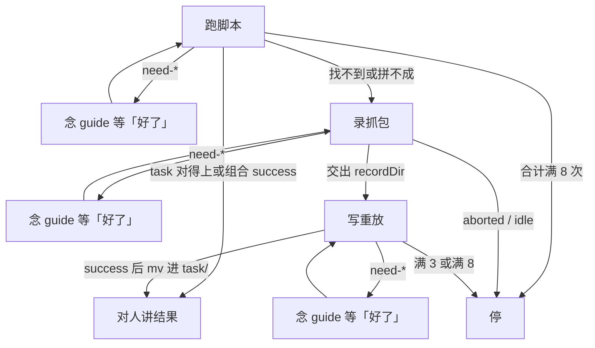

触发 yodo。第一下：按用户任务在 `.yodo/task/*.js` 里找对得上的脚本。



`.yodo` 在用户 home 下。文中路径相对 `.yodo/`，跑命令用绝对路径（Windows 不要用 `~`）。没有 CLI，只有 `src/bin/*.js` 和自执行脚本。`task` 只指 `.yodo/task/*.js`。对人说任务本身，不播报内部状态。安装走同目录 `install.md`，不进本文件。

## 1. 跑脚本

`task/*.js` 和 `tmp/` 组合都读同一套已验证脚本、同一套 stdout（`success` / `failure` / `need-*`），并对人报告 `result` / `resultFile`。检验 URL 都由 agent 看 task 脚本现拼，不从脚本 return 里取。

### 1.1 跑已有 task

分类：

- 能直接跑：`task/*.js` 里有对得上的
- 没有对得上的：不要自己打开站点查看，不要写脚本探接口，不要猜 URL；去录用户操作

怎么跑：

1. 按用户任务找 `task/*.js`（怎么查自定）
2. 读文件头 `@summary`；用到的参数写在头注释里，对应 `argv` 位置
3. `node <home>/.yodo/task/<name>.js [参数]`
4. 参数走 `process.argv`，可缺省；不要改这份脚本
5. 需要浏览器时命令会自己连

stdout 对照：

| stdout | 做什么 |
|---|---|
| `need-install` / `need-chrome` / `need-remote-debugging` / `need-allow` | 把 `guide` 原样念给用户，停，等用户回「好了」，再重跑刚才那条命令。不轮询，不改写 `guide` |
| 只有 `error`、没有 `status` | 命令没跑起来，停，对人说明没跑起来 |
| `status: success` | 对人说这次做成了什么，用 `result` 或 `resultFile`。只说任务本身 |
| `status: failure` | 已经执行并抛错：停，对人说明原因，不要改 `task/` 里的原文件 |

`success` 时：

- 结果超过约 8KB 会落同目录 `output.json`，stdout 给 `resultFile`，打开它再讲
- 检验用的页面地址不要从脚本 return 里取
- 打开刚跑的那份 `task/*.js`，按它的 origin、`goto` / 路径模板、这次 argv，以及 `result` 里的 id，现拼用户能打开核对的 URL
- 必须带正确的 path 和 query
- 不要拿 fetch 端点当检验地址
- 页面靠路径的就深链（如 `/pin/<id>`）
- query 用页面地址栏那几个键，不是 API 全套参数

计入口径：跑 `task/` 不计入本用户任务的 8 次，也不计入同一接口的 3 次。

卡住了杀 `session/pid`（断 CDP，不杀 Chrome）。stdout 不够再看 `session/log.jsonl`。

不是主路径：

- 用户要求断开连接时才跑 `node <home>/.yodo/src/bin/stop.js`
- 要先点一次授权也可以跑 `node <home>/.yodo/src/bin/start.js`（`ok` 即可继续；`need-*` 同样念 `guide`、等「好了」、再重跑），但跑 task 本身已经会连，不是必经

完成：

- 已跑过对得上的文件，并对人讲了结果
- 或已把 `guide` 念出并在等「好了」
- 或现成 task `failure` 后已停并说明
- 没有对得上的：已转入录用户操作，没有先探索站点

### 1.2 组合现有 task

分类：

- 能拼：只用现有脚本里已经验证过的逻辑，不发明新接口；在 `tmp/` 写新文件，不改 `task/` 原文件
- 拼不成：需要现有脚本里没有的接口，或同一接口满 3 次还没 `success` 且合计未满 8 → 去录用户操作
- 合计满 8 次还没 `success`：停，对人说明试了什么、为什么不成；不要再跑 `tmp/`，不要开录

怎么写、怎么跑：

1. 在 `.yodo/tmp/` 写新文件
2. `import` `../task/_common/yodo.js`（`tmp` 里的文件用这条相对路径）
3. `node <home>/.yodo/tmp/<name>.js [参数]`
4. 需要浏览器时命令会自己连
5. 不要自己打开站点查看，不要写脚本探接口，不要猜请求

stdout 对照：

| stdout | 做什么 |
|---|---|
| `need-install` / `need-chrome` / `need-remote-debugging` / `need-allow` | 把 `guide` 原样念给用户，停，等用户回「好了」，再重跑刚才那条命令。不轮询，不改写 `guide` |
| 只有 `error`、没有 `status` | 命令没跑起来，停，对人说明；这次不计入同一接口的 3 次，也不计入本用户任务的 8 次 |
| `status: success` | 写上 `@summary` 和参数说明，只有出现过 `status: success` 才能 `mv` |
| `status: failure` | 同一接口不到 3 次、合计不到 8 次：改 `tmp/` 再跑 |

硬规则：本用户任务内，`node <home>/.yodo/tmp/` 且 stdout 为 `status: success` 或 `status: failure` 的次数合计最多 8；同一接口最多 3。先碰到哪条停哪条。不要第 4 次（同一接口），不要第 9 次（合计）。`need-*` 等人「好了」后重跑同一条、只有 `error` 没有 `status`、以及 `node .../task/`（含 `mv` 之后那遍）：都不算。没出现过 `success` 不准把脚本放进 `task/`。

`success` 后留下：

1. `mv <home>/.yodo/tmp/<name>.js <home>/.yodo/task/<name>.js`（Unix `mv`，不是 yodo 子命令）
2. 再 `node <home>/.yodo/task/<name>.js [参数]`
3. task 这遍同样会自己连浏览器；`need-*` 就把 `guide` 原样念给用户，停，等「好了」，再重跑

这遍 `success`：

- 对人说这次做成了什么，用 `result` 或 `resultFile`。只说任务本身
- 大结果落同目录 `output.json` 时，打开 `resultFile` 再讲
- 检验用的页面地址不要从脚本 return 里取
- 打开刚跑的那份 `task/*.js`，按它的 origin、`goto` / 路径模板、这次 argv，以及 `result` 里的 id，现拼用户能打开核对的 URL
- 必须带正确的 path 和 query
- 不要拿 fetch 端点当检验地址
- 页面靠路径的就深链（如 `/pin/<id>`）
- query 用页面地址栏那几个键，不是 API 全套参数

卡住了杀 `session/pid`（断 CDP，不杀 Chrome）。stdout 不够再看 `session/log.jsonl`。

完成：

- `tmp` 上出现过 `status: success`，`task/` 多了一份能再跑成功的文件，并对人讲了结果
- 或已转入录用户操作（拼不成 / 同一接口满 3 次）
- 或合计满 8 次后已停并报告
- 没有先自主探索；没出现过 `success` 不准进 `task/`

## 2. 录抓包

开录、等人、停录、放弃都只动 `src/bin/record-*.js` 和归档后的 `record/<name>/`，共享同一套 stdout（`recording` / `stopped` / `aborted` / `idle`）。

### 2.1 录用户操作

分类：

- 该录：没有相关 task，或现有脚本拼不成（含同一接口满 3 次还没 success，合计未满 8）
- 不要录：合计已满 8 次还没 success
- 不要这次了：`node <home>/.yodo/src/bin/record-abort.js`

不要先自己打开站点查看、写脚本探接口、猜请求，再决定要不要录。只在新窗口做，已有窗不录。`stop` / `abort` 只关录制窗。5 分钟到会按 stop 归档。

命令：

1. 开录：`node <home>/.yodo/src/bin/record-start.js [name]`
2. 需要浏览器时命令会自己连
3. 不要这次了：`node <home>/.yodo/src/bin/record-abort.js`

stdout 对照：

| stdout | 做什么 |
|---|---|
| `need-install` / `need-chrome` / `need-remote-debugging` / `need-allow` | 把 `guide` 原样念给用户，停，等用户回「好了」，再重跑刚才那条命令。不轮询，不改写 `guide` |
| `status: recording` | 把 `guide` 原样念给用户（请用户在新窗口做一遍），停，等用户回「好了」，再 `node <home>/.yodo/src/bin/record-stop.js`。这时还没有 `recordDir`，不要读 `record/.active/` |
| `status: stopped` 且有 `recordDir` | 去读这个目录 |
| `aborted` | 对人说明这次不要了；没有可用抓包，停 |
| `idle` | 对人说明当时没在录；没有可用抓包，停 |

`recordDir` 里的文件：

| 文件 | 是什么 | 怎么读 |
|---|---|---|
| `timeline.jsonl` | 索引。行：`type`、`requestType`、`method`、`url`、`file` | 小，任意读 |
| `01_GET_host.json` | request：`url`（`bareUrl` + `query`）、`frameUrl`、`headers`、`body`；这里的 `status` 是 HTTP，不是 yodo 的 `status` | 小，任意读 |
| `01_GET_host.response.json` | 响应体 > 1KB 时拆出 | 大，不要整份读 |
| `01_GET_host.response.html` | 整页 HTML | 大，不要整份读 |

卡住了杀 `session/pid`（断 CDP，不杀 Chrome）。stdout 不够再看 `session/log.jsonl`。

完成：

- `status: stopped` 且手上有 `recordDir`，可以去写重放
- 或已说明没有抓到并停（`aborted` / `idle`）
- 开录之前没有自己打开站点、没有写探接口脚本
- 合计已满 8 次还没 success 时没有开录

## 3. 写重放

写脚本只认这份抓包和 `_common/yodo.js` 暴露的 API，只重放抓到的请求；试跑仍落在 `tmp/`，成功才进 `task/`。

### 3.1 对着抓包写出脚本

分类：

- 只重放抓到的请求；没抓到的不补、不猜
- 只发网络请求，不操作 DOM，也不拿 DOM 快照来操作
- 正路是复用已登录的 origin 页，在页内 `fetch` / XHR
- 没有抓包就不要写这一节

对着抓包：

1. 先读 `timeline.jsonl`（小，索引），定要重放的接口
2. 再打开对应的 request JSON（小）
3. `late` 的 `mainDoc` 是迟到的页面快照，没有 `method`、也没有 HTTP `status`，比一次 HTML GET 信息更丰富：在这份快照里找信息，也可以对那个 `url` 再做 HTML GET

在 `tmp/<name>.js` 写自执行脚本，然后 `node <home>/.yodo/tmp/<name>.js [参数]`：

```javascript
import { yodo, pageForOrigin, serializeUrl } from "../task/_common/yodo.js";
const ORIGIN = "https://example.com";
const q = process.argv[2] ?? "默认值";
await yodo.run(async ({ browserContext }) => {
  const page = await pageForOrigin(browserContext, ORIGIN);
  await page.goto(serializeUrl({ bareUrl: `${ORIGIN}/search`, query: { q } }));
  const data = await page.evaluate(async (q) => {
    /* 带登录态 fetch / XHR；只能用可序列化参数，不能闭包外层变量 */
    return {};
  }, q);
  return data;
});
```

API：

- `_common/yodo.js` 给出 `yodo`、`pageForOrigin`、`serializeUrl`、`parseUrl`
- `pageForOrigin(browserContext, origin)` 只复用本次 run 窗里同 origin 的 page，没有就在该窗现有 tab 上 goto；不挂用户已有 tab
- `yodo.run` 在本进程跑闭包，浏览器操作发给已连上的 Chrome；闭包 return 的值变成 stdout 的 `result`
- 不要在 return 里写 `url`
- `page.goto(url, { timeout }?)` 没有 `waitUntil`
- `page.evaluate(fn, ...args)` 只能传可 JSON 序列化的参数
- `page.url()` / `page.title()` / `page.close()` / `page.bringToFront()` / `browserContext.newPage()` 也在，写重放用不到就别用

需要浏览器时命令会自己连。

stdout 对照：

| stdout | 做什么 |
|---|---|
| `need-install` / `need-chrome` / `need-remote-debugging` / `need-allow` | 把 `guide` 原样念给用户，停，等用户回「好了」，再重跑刚才那条命令。不轮询，不改写 `guide` |
| 只有 `error`、没有 `status` | 命令没跑起来，停，对人说明；这次不计入同一接口的 3 次，也不计入本用户任务的 8 次 |
| `status: success` | 写上 `@summary` 和参数说明，只有出现过 `status: success` 才能 `mv` |
| `status: failure` 且 403 | 多半是缺客户端签名，改走页内 XHR（站点常 monkey-patch `XMLHttpRequest`，会自动注入 `a_bogus` / `X-Bogus`），比手写逆向稳。页内太慢就减小数据量 |
| `status: failure` | 同一接口不到 3 次、合计不到 8 次：改 `tmp/` 再跑 |

硬规则：本用户任务内，`node <home>/.yodo/tmp/` 且 stdout 为 `status: success` 或 `status: failure` 的次数合计最多 8（含组合阶段已用掉的）；同一接口最多 3。先碰到哪条停哪条。不要第 4 次（同一接口），不要第 9 次（合计）。`need-*` 等人「好了」后重跑同一条、只有 `error` 没有 `status`、以及 `node .../task/`（含 `mv` 之后那遍）：都不算。没出现过 `success` 不准把脚本放进 `task/`。

`success` 后留下：

1. `mv <home>/.yodo/tmp/<name>.js <home>/.yodo/task/<name>.js`
2. 再 `node <home>/.yodo/task/<name>.js [参数]`
3. task 这遍会自己连浏览器；`need-*` 就把 `guide` 原样念给用户，停，等「好了」，再重跑

这遍 `success`：

- 对人说这次做成了什么，用 `result` 或 `resultFile`。只说任务本身
- 大结果落同目录 `output.json` 时，打开 `resultFile` 再讲
- 检验用的页面地址不要从脚本 return 里取
- 打开刚跑的那份 `task/*.js`，按它的 origin、`goto` / 路径模板、这次 argv，以及 `result` 里的 id，现拼用户能打开核对的 URL
- 必须带正确的 path 和 query
- 不要拿 fetch 端点当检验地址
- 页面靠路径的就深链（如 `/pin/<id>`）
- query 用页面地址栏那几个键，不是 API 全套参数

同一接口满 3 次、或合计满 8 次，仍无 `success`：停，写清接口、原因、试了什么，并对人说明这次做不成。不要再改 `tmp/` 再跑。

卡住了杀 `session/pid`（断 CDP，不杀 Chrome）。stdout 不够再看 `session/log.jsonl`。

完成：

- `mv` 完成并跑成功，已对人讲了结果
- 或满 3 / 满 8 后停，写清接口、原因、试了什么
- 没出现过 `success` 不准进 `task/`
