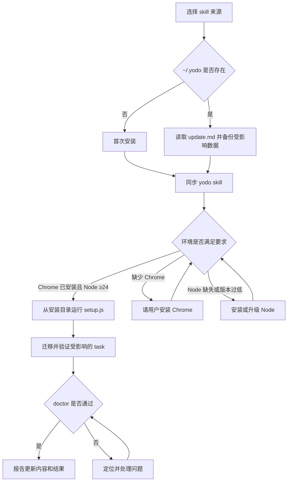

# 安装与更新 yodo

安装和更新使用同一套流程。在线安装从 GitHub 默认分支 `main` 获取 skill；本地开发安装从当前 repository 获取 skill。除此之外，环境检查、数据处理、`setup.js` 和验收完全相同。

- `~/.yodo` 不存在时，按首次安装处理，不执行历史迁移。
- `~/.yodo` 已存在时，先阅读 [更新说明](./update.md)，检查并备份受影响的数据，再安装和迁移。



先从当前来源读取本文件。更新已有安装时，同时读取同一来源的 `update.md` 并备份受影响的数据。同步 skill 后，从实际安装目录运行 `setup.js`，根据最新版要求迁移已有数据，再运行 doctor 验收并向用户报告。

## 1. 同步 yodo skill

### 1.1 选择来源并同步

在线安装或更新使用：

```bash
npx skills add yanggggjie/yodo -g -y -a '*' -s yodo
```

本地开发安装或更新，在 repository 根目录使用：

```bash
npm run dev:install
```

它等价于从当前 repository absolute path 执行 `skills add`。除 skill 来源外，后续流程与在线安装相同。

完成后检查全局 skill：

```bash
npx skills ls -g
```

确认列表中存在 `yodo`，并找到本次安装后的 yodo skill 目录。后续必须从这个实际安装目录运行 `setup.js`，确保 agent 读取的 skill 与部署到 `~/.yodo/src` 的运行时来自同一版本；本地安装也不得直接运行 repository 中的 `skills/yodo/setup.js`。

## 2. 检查运行环境

### 2.1 检查 Google Chrome

运行 `setup.js` 前，Google Chrome 和 Node 必须同时满足要求。

只检查本机是否已安装 Google Chrome。此时不要求 Chrome 已经打开，也不要求已经开启 remote debugging。

如果没有安装，将 [Google Chrome 下载地址](https://www.google.com/chrome/) 交给用户，请用户自行安装。等待用户回复“好了”后，再确认一次。agent 不代替用户运行 Chrome 安装包。

### 2.2 检查 Node ≥24

检查当前版本：

```bash
node -p process.version
```

如果 Node 不存在或 major 小于 24，使用本机已有方式安装或升级，例如 fnm、nvm、Homebrew 或官方安装方式。完成后重新检查版本，确认 major ≥24 再继续。

> [!IMPORTANT]
> `setup.js` 也会拒绝 Node <24，但应在执行前完成检查。

## 3. 部署运行时

### 3.1 运行 setup

> [!WARNING]
> setup 会中断当时正在运行的 `task` 或 `recording`，因此不要在执行期间安装或更新。

确认当前没有正在运行的 yodo `task` 或 `recording`，然后进入刚安装的 yodo skill 目录，运行：

```bash
node setup.js
```

`setup.js` 会依次完成：

1. 检查 Node ≥24。
2. 停止旧 holder，并清理 stale socket 和 pid。
3. 用当前 skill 的 `src/` 替换 `~/.yodo/src`，不复制源目录中的 `node_modules`。
4. 在 `~/.yodo/src` 运行 `npm install --omit=dev --omit=optional`。
5. 调用 `~/.yodo/src/bin/init.js`，创建数据目录并同步 `task/lib/`。

setup 不会在 `~/.yodo/src` 中写 `task`，也不会在完成后重新启动 holder。

### 3.2 保留用户数据

| 路径 | setup 的处理 |
|---|---|
| `~/.yodo/src` | 清空后部署当前版本的运行时，并重新安装依赖 |
| `~/.yodo/task` | 保留 capability；更新时按 `update.md` 备份、迁移并验证，刷新 `lib/` 和 package 元数据 |
| `~/.yodo/temp` | 不保证兼容，不纳入更新迁移 |
| `~/.yodo/record` | 原样保留，不修改已有 record |
| `~/.yodo/session` | 停止旧 holder并按新版本重建运行状态 |

### 3.3 处理部署错误

部署成功后，应存在以下依赖文件：

```text
~/.yodo/src/node_modules/tldts/dist/cjs/index.js
```

如果 setup 报错，先根据本次 stdout、stderr 和 `setup.js` 源码定位，不要编写另一套安装脚本绕过它。

## 4. 验收安装结果

### 4.1 检查目录和文件

| 路径 | 应有内容 |
|---|---|
| `~/.yodo/src` | 当前运行时源码、`package-lock.json` 和本地依赖 |
| `~/.yodo/task` | `capability`、`package.json` 和 `lib/` |
| `~/.yodo/temp` | `candidate` 和 `package.json` |
| `~/.yodo/record` | `record` 和内部 `.active/` |
| `~/.yodo/session` | holder 的 pid、连接状态和 `log.jsonl` |
| `~/.yodo/task/lib/index.js` | `task` 使用的 SDK 与 helper 入口 |
| `~/.yodo/src/node_modules/tldts/dist/cjs/index.js` | 运行时依赖 marker |

### 4.2 补齐缺失内容

任何一项缺失时，回到已安装的 yodo skill 目录重新运行：

```bash
node setup.js
```

如果 `~/.yodo/src` 和依赖已经正确，仅缺数据目录或 `lib/`，可以运行：

```bash
node ~/.yodo/src/bin/init.js
```

`init.js` 只创建或补齐数据目录，并刷新 `task` 的共享模板；完整 setup 已经会自动调用它。

### 4.3 完成检查

- [ ] `npx skills ls -g` 中存在 `yodo`。
- [ ] Google Chrome 已安装。
- [ ] Node major ≥24。
- [ ] `~/.yodo/src` 来自本次安装的 skill，且依赖 marker 存在。
- [ ] `~/.yodo/src`、`~/.yodo/task`、`~/.yodo/temp`、`~/.yodo/record`、`~/.yodo/session` 全部存在。
- [ ] `~/.yodo/task/lib/index.js` 存在。
- [ ] 首次安装未执行历史迁移；更新已有安装时，已按 `update.md` 检查、迁移并验证现有数据。
- [ ] 更新没有修改或删除已有 `record`。

## 5. 诊断异常

### 5.1 运行 doctor

布局不完整、运行路径不对、依赖缺失或 holder 状态可疑时，运行：

```bash
node ~/.yodo/src/bin/doctor.js
```

重点检查：

- Node 版本是否满足要求；
- yodo home 是否正确；
- `running from` 是否位于 `~/.yodo/src`；
- `src` 与依赖 marker 是否存在；
- `task`、`temp`、`record`、`session` 是否完整；
- holder 是 alive、stale 还是不存在。

### 5.2 根据结果处理

doctor 只报告状态，不执行安装。根据异常项重新运行 setup 或 init。对用户只说明与当前问题有关的结论和处理，不机械转述整段输出。
