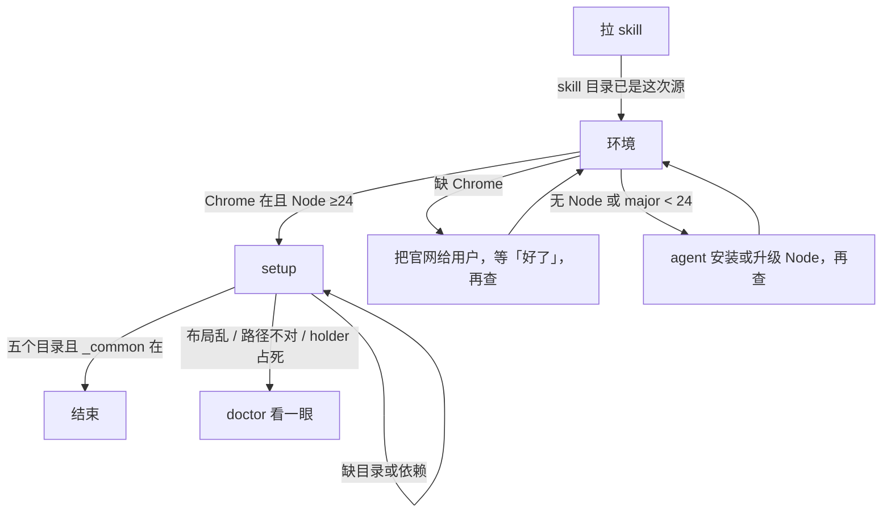

安装和更新都只在这份做。不新造脚本。第一下：跑 `skills add`，再查 Chrome 和 Node，都齐了才跑 `setup.js`。`.yodo/{src,task,tmp,record,session}` 都在，才算完。再跑这一遍就是更新。

`.yodo` 在用户 home 下。能推断就用；不能：`node -p "require('os').homedir()"`，再拼 `.yodo`。跑命令用绝对路径（Windows 不要用 `~`）。

`need-chrome` / `need-remote-debugging` / `need-allow` 不是安装或更新失败。那些是第一次连浏览器。装好 Chrome 但还没打开、还没开远程调试、还没点 Allow，继续往下做这份。

# 1. 拉 skill

只动本机已装的 skill 目录，共用 Skills CLI，不进 `.yodo`，也不查 Chrome / Node。

## 1.1 跑 skills add

目标：本机各 agent 的 yodo skill 与这次要装的源一致（上游仓库或本地仓）。

分类：

- 用户 / 线上：跟 GitHub 默认分支 `main`
- 开发：跟本仓库本地路径

操作：

- 用户 / 线上：`npx skills add yanggggjie/yodo -g -y -a '*' -s yodo`
- 开发：`npx skills add . -s yodo -g -a '*' -y`（仓库根，或 `npm run dev:install` 的前半）。不要用线上 `main` 做开发安装
- 不要写 `src-version`，不要另开 `release` 分支
- 不要 `skills update`，不要 `--copy`

完成：

- `npx skills ls -g` 可见 `yodo`
- 内容在 `~/.agents/skills/yodo`（或本机等价路径），且是这次 `skills add` 的源

# 2. 环境

Chrome 和 Node 都是跑 `setup.js` 之前的本机条件，材料都是「有没有 / 版本够不够」，不进 `.yodo`。缺了怎么补不一样：Chrome 只请用户自己装；Node 由 agent 安装或升级。装好 Chrome 但还没打开、还没开远程调试、还没点 Allow，不是这一组的失败。

## 2.1 确认 Chrome 已装

目标：本机有 Google Chrome。

分类：

- 要确认的：本机有没有 Google Chrome
- 不是：已经打开
- 不是：已经开了 remote-debugging

操作：

1. 只问有没有 Google Chrome
2. 没有：把 https://www.google.com/chrome/ 给用户，请他自己装。agent 不代装、不跑安装包、不写安装脚本
3. 请他装好回「好了」，再看一次
4. 不要把代码里的 Chrome 路径表抄进来

完成：能指出 Chrome 在，或已把安装说明给人并在等「好了」。

## 2.2 确认 Node ≥ 24

目标：本机 `node` 的 major ≥ 24。

操作：

1. `node -p process.version`
2. 没有 Node，或 major < 24：agent 帮用户安装或升级到当前的 Node（major ≥ 24）。用本机已有方式（如 `fnm` / `nvm` / Homebrew / 官方安装包），不要为 yodo 新造 Node 安装脚本
3. `setup.js` 自己也会拦不够的版本，不要另写一个检查脚本
4. 装或升级完再 `node -p process.version` 查一次。major ≥ 24 才往下走

完成：`process.version` 的 major ≥ 24。

# 3. setup

`setup.js` / `init.js` / `doctor.js` 都只动 `.yodo` 布局和依赖，共用同一套完成条件（五个目录 + `_common`）。首次和再跑收在这里，不把「更新」拆出去。

## 3.1 跑 setup.js

目标：`<home>/.yodo/src` 是这次 skill 里的 `src/` 拷贝，依赖已装，数据目录已建或已补齐。

分类：

- 首次：原来没有 `.yodo/src`，跑完后有
- 再跑：覆盖 `.yodo/src`（更新或修缺目录）。同一条命令

分类（碰 / 不碰）：

- 覆盖：`.yodo/src`
- 不碰：用户和 agent 写在 `task/` `tmp/` 的脚本；不清 `record/` 里已有抓包
- 不要在 `.yodo/src` 写业务脚本

操作：

1. Chrome 和 Node 都齐了才跑
2. 在 skill 目录（这份文件和 `SKILL.md` 旁边）执行 `node setup.js`
3. 不要另写安装或更新脚本
4. 报错就对着这次输出和 `setup.js` 源码给办法

`setup.js` 一次做完：

1. 检查 Node ≥24
2. 停旧 holder（`session/pid` 还活着就 `SIGTERM`，清 stale sock / pid；不停则下一步会删掉该进程脚下的 `src/`，且之后 `ping` 仍复用旧进程）
3. 把本 skill 的 `src/` 拷到 `<home>/.yodo/src`（先清空 dest，不拷 source 里的 `node_modules`）
4. 在 dest `npm install`
5. 调 `src/bin/init.js`：建 `task/` `tmp/` `record/` `session/`，同步 `task/_common/`

停 holder 的代价：

- 断那条 CDP。下次连浏览器若 stdout 是 `need-allow` 或其它 `need-*`：把 `guide` 原样念给用户，停，等「好了」，再重跑那条连浏览器的命令。不轮询，不改写 `guide`
- 当时在录制或有 task 在跑会被掐掉。不要叠在录制 / 任务上跑 setup
- setup 不要再拉起 holder。下次 `start.js` 或跑 task 会自己连

完成：绝对路径下存在 `.yodo/src`，且其中有 `node_modules/tldts/dist/cjs/index.js`。

## 3.2 验收目录

目标：安装或更新在布局上结束。

这五个都要在：

| 目录 | 安装要留下 |
|---|---|
| `.yodo/src` | 源码拷贝 + 本地 `npm install` 的依赖。没有它 = 未初始化 |
| `.yodo/task` | 以后放已验证脚本。安装时带上 `_common/` |
| `.yodo/tmp` | 以后试跑 |
| `.yodo/record` | 以后放抓包 |
| `.yodo/session` | pid · sock · log.jsonl |

操作：

1. 查上面五个目录都在
2. 查 `task/_common/yodo.js` 在
3. 缺一块：在 skill 目录（这份文件和 `SKILL.md` 旁边）执行 `node setup.js`。不要另写安装或更新脚本
4. 只缺数据目录时可以单独 `node <home>/.yodo/src/bin/init.js`（建四个数据目录并同步 `_common/`；`setup.js` 已经会调）

完成：五个目录都在，且 `task/_common/yodo.js` 在。安装或更新结束。

## 3.3 doctor 看一眼

目标：布局仍乱、路径不对、依赖缺失、holder 占死时，自己看到本机状态。

操作：

1. `node <home>/.yodo/src/bin/doctor.js`
2. 看 Node、`platform`、`home`、`src`、依赖、四个数据目录、holder
3. 不推进安装或更新
4. 不要把整段输出念给用户

完成：已看过这次输出；对不上的项能对着 `setup.js` / 源码给办法。
